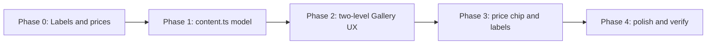

# Implementation Plan — Gallery Categories

Rework the Galéria section so visitors **choose a product category first**. Images (and starting prices) appear only after a leaf category is selected.

All work is **frontend-only**. No backend, no CMS.

---

## Problem

The gallery currently behaves like a photo dump:

- Default filter is **Összes** — every image is visible on load.
- Filters are material-based (`Anyatejes` / `Hajas` / `Kombinált`), not product types.
- FAQ already tells visitors that **prices live in the gallery** (`faq7`), but the gallery does not show prices, and the standalone Pricing section (`#arak`) is a separate, generic tier list.

Visitors cannot browse by the products Szabina actually sells: rings (with two styles), memory beads, and pendants.

---

## Goal

1. **Empty by default.** No images until the visitor picks a category that can show a grid.
2. Empty-state copy tells them to **select a category to see images and prices**.
3. Three main category buttons:
   - **Gyűrűk**
   - **Emlék gyöngyök**
   - **Medálok**
4. **Gyűrűk** is not a leaf. Selecting it reveals two sub-category buttons:
   - **Mithril gyűrűk**
   - **Csepp gyűrűk**
5. Ring images appear **only after** a sub-category is clicked. Emlék gyöngyök and Medálok show images immediately (they have no sub-categories).

Keep the existing card grid, mobile “Több mutatása”, lightbox, and visual language. Change **what is selected and when the grid appears**, not the whole gallery aesthetic.

---

## Current vs Target Behaviour

| State | Today | Target |
|---|---|---|
| Initial load | All images, “Összes” active | No images; prompt to pick a category |
| Filters | Összes / Anyatejes / Hajas / Kombinált | Gyűrűk / Emlék gyöngyök / Medálok |
| Gyűrűk | n/a | Sub-buttons appear; still no images |
| Mithril / Csepp | n/a | Grid + starting price for that ring type |
| Emlék gyöngyök / Medálok | n/a | Grid + starting price immediately |
| “Összes” | Default | **Removed** — no all-images view |

```
Initial
  └── prompt: choose a category to see images and prices

Gyűrűk selected
  └── sub-buttons: Mithril gyűrűk | Csepp gyűrűk
  └── still no images (second prompt: pick a ring type)

Gyűrűk → Mithril gyűrűk
  └── mithril images + price

Gyűrűk → Csepp gyűrűk
  └── csepp images + price

Emlék gyöngyök
  └── bead images + price (no sub-row)

Medálok
  └── pendant images + price (no sub-row)
```

---

## Scope & Files

| Change | Files (expected) |
|---|---|
| Category tree + items + prices | `src/data/content.ts` |
| Two-level filter UI, empty states, price chip | `src/components/Gallery.tsx` |
| New photos already on disk | `public/images/gallery/{gyuruk,emlekgyongyok,medalok}/` |
| Nav / Pricing section | **Decision** — see “Pricing section” below |
| Header / Footer `#arak` | Only if Pricing is removed or `#arak` moves |

**Do not change** in this pass: lightbox chrome, card hover/skeleton, Framer Motion patterns, Trust / FAQ / Contact.

---

## Information Architecture

```
Galéria
├── Gyűrűk                          ← main, not leaf
│   ├── Mithril gyűrűk              ← leaf → images
│   └── Csepp gyűrűk                ← leaf → images
├── Emlék gyöngyök                  ← main + leaf → images
└── Medálok                         ← main + leaf → images
```

**IDs** (stable, used in data and state):

| Label | `id` |
|---|---|
| Gyűrűk | `gyuruk` |
| Mithril gyűrűk | `mithril` |
| Csepp gyűrűk | `csepp` |
| Emlék gyöngyök | `emlek-gyongyok` |
| Medálok | `medalok` |

---

## Content Model

Replace the current material union and `FILTERS` array with a small category tree plus items tagged by **leaf id**.

### Types (proposed)

```ts
export type GalleryMainId = 'gyuruk' | 'emlek-gyongyok' | 'medalok';
export type GalleryLeafId = 'mithril' | 'csepp' | 'emlek-gyongyok' | 'medalok';

export interface GallerySubcategory {
  id: GalleryLeafId;
  label: string;
  priceFrom: number; // HUF, tájékoztató kezdőár
}

export interface GalleryMainCategory {
  id: GalleryMainId;
  label: string;
  /** Present only on Gyűrűk. */
  children?: GallerySubcategory[];
  /** Present on mains that are also leaves (Emlék gyöngyök, Medálok). */
  priceFrom?: number;
}

export interface GalleryItem {
  id: string;
  title: string;
  caption: string;
  category: GalleryLeafId;
  image: string;
  alt: string;
}

export const galleryCategories: GalleryMainCategory[] = [ /* 3 mains */ ];
export const galleryItems: GalleryItem[] = [ /* tagged by leaf */ ];
```

Remove `export type GalleryCategory = 'anyatej' | 'hajtincs' | 'kombinált'` and the old 8 `gallery-0N.jfif` entries.

### Empty-state copy (Hungarian)

**Nothing selected** (section intro can stay; this is the body placeholder):

> Válassz egy kategóriát, hogy megtekinthesd a képeket és az árakat.

**Gyűrűk selected, no sub yet:**

> Válaszd ki a gyűrű típusát — Mithril gyűrűk vagy Csepp gyűrűk —, hogy lásd a darabokat és a kezdőárat.

Keep the existing section header (eyebrow **Galéria**, H2 **Korábbi alkotások**) unless copy review asks otherwise. Optionally shorten the current subline so it does not contradict the empty state (“Néhány darab a múltból…” still works as context).

### Starting prices

Show a **category-level** `priceFrom` (same “Ft-tól / tájékoztató” pattern as Pricing), not a unique price on every card — unless Szabina later supplies per-piece prices.

**Placeholder amounts** until Szabina confirms (do not invent final retail numbers in code without her). For the first implementation, use clearly marked placeholders in `content.ts`, e.g. comments `// PLACEHOLDER: confirm with Szabina`.

Suggested UI when a leaf is active: a compact price line above the grid, e.g. “Kezdőár: 15 000 Ft-tól” plus a one-line disclaimer that the final price is set after consultation.

---

## Image Inventory (already on disk)

New folders exist and should become the source of truth. Do **not** keep using the root `gallery-01.jfif` … `gallery-08.jfif` files (old material-based set).

| Leaf | Folder | Count (as of this plan) |
|---|---|---|
| Mithril gyűrűk | `public/images/gallery/gyuruk/mithril/` | 5 |
| Csepp gyűrűk | `public/images/gallery/gyuruk/csepp/` | 2 |
| Emlék gyöngyök | `public/images/gallery/emlekgyongyok/` | 14 |
| Medálok | `public/images/gallery/medalok/` | 5 |

Paths in data: `images/gallery/gyuruk/mithril/….jpg` (same public-root convention as today).

**Content prep for items:** titles, captions, and `alt` for the new photos are not written yet. First pass can use short, honest placeholders (e.g. “Mithril gyűrű”, category-based alt) and a checklist item for Szabina to name pieces later. Prefer not to reuse the old anyatej/hajtincs captions — they describe different jewellery.

**Filenames with spaces** (e.g. `IMG_20260716_180245 (1).jpg`): either URL-encode in the `src` string or rename files to kebab-case during implementation. Renaming is cleaner.

---

## UI Behaviour (`Gallery.tsx`)

### State

Replace `active: FilterKey` (`'osszes' | material`) with two independent values:

```ts
const [mainId, setMainId] = useState<GalleryMainId | null>(null);
const [leafId, setLeafId] = useState<GalleryLeafId | null>(null);
```

Rules:

1. Click a **main with children** (`gyuruk`): set `mainId`, **clear `leafId`**. Show sub-buttons. Hide grid.
2. Click a **main that is a leaf** (`emlek-gyongyok`, `medalok`): set `mainId` and `leafId` to that id. Hide sub-row. Show grid.
3. Click a **sub-button**: keep `mainId = 'gyuruk'`, set `leafId` to `mithril` or `csepp`. Show grid.
4. Clicking the **already-selected main** again: deselect (`mainId` and `leafId` → `null`) so the visitor can return to the empty prompt. Alternative (if this feels jumpy in QA): leave it selected. Prefer deselect — it matches “nothing shown until you choose”.
5. Changing main or leaf **resets** `isExpanded` (mobile see-more) and **closes** the lightbox (`selectedIndex = null`).

Visible items:

```ts
const items = leafId
  ? galleryItems.filter((i) => i.category === leafId)
  : [];
```

Grid, mobile overlay, “Több mutatása”, and lightbox render **only when `items.length > 0`**.

### Category buttons (row 1)

Reuse the current pill styles (`rounded-full`, active = blush→warmrose gradient, inactive = bordered white).

- Three buttons from `galleryCategories`.
- Active main: `mainId === category.id`.
- No “Összes” pill.

### Sub-category buttons (row 2)

Show **only when** the selected main has `children`.

- Animate in with `AnimatePresence` (height/opacity), so Gyűrűk does not jump the page.
- Same pill language, slightly smaller or nested visually (e.g. `mt-3`, `text-sm`) so they read as a second step, not a second set of mains.
- Active sub: `leafId === child.id`.

### Empty states

A centered, calm placeholder (icon optional — Lucide `Images` or `Sparkles`) in the current cream/blush language:

- Default copy when `mainId === null`.
- Gyűrűk-only copy when `mainId === 'gyuruk' && leafId === null`.

Do not render an empty grid or the mobile toggle in these states.

### Price chip

When `leafId` is set, resolve `priceFrom` from the matching subcategory or from the main category, and show it above the grid (and optionally in the lightbox). Format with the existing HUF helper pattern from Pricing (`hu-HU`, “Ft-tól”).

### Cards & lightbox labels

Replace the hardcoded material labels:

```ts
item.category === 'anyatej' ? 'Anyatejes ékszer' : …
```

with a small `LEAF_LABELS` map (or look up from `galleryCategories`) so chips read **Mithril gyűrű**, **Csepp gyűrű**, **Emlék gyöngy**, **Medál**.

### Accessibility

- Main pills: `role="tablist"` / `role="tab"` **or** a radiogroup. Prefer a **radiogroup** named “Kategória” (not tabs), because Gyűrűk does not immediately show a panel.
- Sub pills: second radiogroup “Gyűrű típusa”, only in the DOM when Gyűrűk is selected.
- `aria-pressed` or `aria-checked` on the selected pill.
- Empty-state region: `aria-live="polite"` so screen readers hear the prompt after a click.
- Visible focus rings (already used on other buttons).

---

## Pricing Section — Decision (do not silently delete)

FAQ (`faq7`) already says prices are in the gallery. After this change that becomes true.

**Recommendation:** keep the standalone Pricing section **out of this PR**. Gallery starts showing category `priceFrom`; `#arak` still works. A follow-up can:

- Point Header/Footer **Árak** to `#galeria`, and/or
- Retire `Pricing.tsx` once Szabina confirms the gallery prices replace the three generic tiers.

Do **not** implement that follow-up unless explicitly requested.

---

## Implementation & Tracking Checklist

### Phase 0: Content prep
- [ ] Confirm Hungarian labels: Gyűrűk / Mithril gyűrűk / Csepp gyűrűk / Emlék gyöngyök / Medálok
- [ ] Confirm placeholder vs real `priceFrom` per leaf (Szabina)
- [ ] Decide whether old `gallery-0N.jfif` files are deleted or left unused
- [ ] Optional: rename files that contain spaces/`(1)` to kebab-case

### Phase 1: Data model
- [ ] Add `GalleryMainId`, `GalleryLeafId`, `galleryCategories` in `content.ts`
- [ ] Replace `galleryItems` with new photos tagged by leaf id
- [ ] Add placeholder titles / captions / alt (marked for review)
- [ ] Remove old `GalleryCategory` union and jfif entries

### Phase 2: Filter UX
- [ ] Two-level state (`mainId`, `leafId`); default both `null`
- [ ] Main pills; no “Összes”
- [ ] Sub-pills only for Gyűrűk; images only after a leaf is selected
- [ ] Empty-state copy (default + Gyűrűk-without-sub)
- [ ] Reset expand + lightbox on category change

### Phase 3: Prices & labels
- [ ] Starting-price line when a leaf is active
- [ ] Card + lightbox category chips use new leaf labels
- [ ] Disclaimer: tájékoztató ár, végleges a konzultáción

### Phase 4: Polish & verify
- [ ] Keep mobile 3-item collapse for large leaves (especially Emlék gyöngyök, 14 photos)
- [ ] Sub-row animation does not cause layout jump
- [ ] `npm run lint` and `npm run typecheck`
- [ ] Visual check: 320 / 375 / 640 / 1024

---

## Verification Plan

### Interaction

1. Load `#galeria`: **zero** images; prompt visible; no main pill selected.
2. Click **Medálok**: 5 pendant images + price; no sub-row.
3. Click **Emlék gyöngyök**: bead images + price; no sub-row; mobile shows 3 + “Több mutatása”.
4. Click **Gyűrűk**: sub-buttons appear; **still no images**; second prompt visible.
5. Click **Mithril gyűrűk**: 5 mithril images + price.
6. Click **Csepp gyűrűk**: 2 csepp images + price; lightbox count is `1 / 2`.
7. Switch back to **Medálok**: sub-row gone; pendant grid only.
8. Click the active main again (if deselect is implemented): return to empty prompt.

### Regression

- Lightbox: Esc, arrows, prev/next, body scroll lock.
- Mobile expand/collapse; “Kevesebb mutatása” still scrolls to `#galeria`.
- Header **Galéria** still lands on `#galeria`.
- Pricing (`#arak`) unchanged in this pass.

---

## Out of Scope

- Removing or relocating the Pricing section / `#arak` nav
- Per-item unique prices on every card
- Backend, CMS, or admin for photos
- New product types (earrings, bracelets, sets) — add as extra mains later
- Instagram feed
- Rewriting FAQ beyond what already points at the gallery

---

## Suggested Implementation Order



Start with data (categories + items pointing at the new folders), then the empty/default + Gyűrűk sub-step in `Gallery.tsx`, then price display. Do not code until this plan is accepted.
