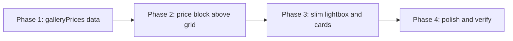

# Implementation Plan — Gallery Prices & Simplified Lightbox

Replace the placeholder single “kezdőár” chip with the real price matrix from [notes.txt](notes.txt), shown **above the image grid** when a leaf category is selected. Strip the lightbox so a click shows **only the photo and the piece name**.

All work is **frontend-only**. Category navigation from [IMPLEMENTATION-GALLERY-CATEGORIES.md](IMPLEMENTATION-GALLERY-CATEGORIES.md) stays as-is.

---

## Problem

The gallery currently shows one generic starting price per leaf (`15 000` / `25 000 Ft-tól`). Real pricing depends on:

1. **Product** (Mithril, Csepp, Emlékgyöngy, Medál)
2. **Filling** — *anyatej és/vagy haj* vs *csak haj*
3. **Metal** — *Nemesacél* vs *Ezüst tartalmú ötvözet* (beads and pendants only)

Rings are **only** ezüst tartalmú ötvözet.

The lightbox still repeats caption, price, category chip, explanatory copy, and a Contact CTA. After this change, prices live above the grid; clicking a photo should not re-sell the piece.

---

## Goal

1. When a **leaf category** is selected (Mithril / Csepp / Emlék gyöngyök / Medálok), show that category’s **full price table above the images**.
2. Encode materials and fillings correctly:
   - **Emlék gyöngyök** and **Medálok**: Nemesacél **and** Ezüst tartalmú ötvözet; buyer chooses filling (anyatej és/vagy haj, or csak haj).
   - **Gyűrűk** (Mithril and Csepp): Ezüst tartalmú ötvözet **only**; buyer still chooses filling.
3. Use the amounts from `notes.txt` (no placeholders).
4. Lightbox: **image + name only**. No caption, price, chip, CTA, or extra paragraph.

---

## Price Source (`notes.txt`)

Hungarian labels for the UI:

| notes.txt | UI label |
|---|---|
| Milk and or hair | Anyatej és/vagy haj |
| Hair only | Csak haj |
| Nemesacél | Nemesacél |
| Ezüst tartalmú ötvözet | Ezüst tartalmú ötvözet |

Amounts in HUF:

### Mithril gyűrűk — csak ezüst tartalmú ötvözet

| Filling | Price |
|---|---|
| Anyatej és/vagy haj | 45 000 |
| Csak haj | 38 000 |

### Csepp gyűrűk — csak ezüst tartalmú ötvözet

| Filling | Price |
|---|---|
| Anyatej és/vagy haj | 40 000 |
| Csak haj | 35 000 |

### Emlék gyöngyök

| Filling | Nemesacél | Ezüst tartalmú ötvözet |
|---|---|---|
| Anyatej és/vagy haj | 28 000 | 45 000 |
| Csak haj | 19 000 | 38 000 |

### Medálok

| Filling | Nemesacél | Ezüst tartalmú ötvözet |
|---|---|---|
| Anyatej és/vagy haj | 29 000 | 45 000 |
| Csak haj | 20 000 | 38 000 |

---

## Scope & Files

| Change | Files (expected) |
|---|---|
| Price types + tables; drop `priceFrom` | `src/data/content.ts` |
| Price block above grid; slim lightbox | `src/components/Gallery.tsx` |
| Standalone Pricing (`#arak`) | **Out of scope** |
| FAQ copy | **Out of scope** (`faq6` / `faq7` already point at gallery materials/prices) |

Do **not** change filter behaviour, empty states (aside from copy that still says “kezdőár”), mobile “Több mutatása”, or image inventory.

---

## Content Model

Remove `priceFrom` from `GallerySubcategory` and `GalleryMainCategory`. Stop returning `priceFrom` from `getGalleryLeafMeta`.

Add a typed price table keyed by leaf id:

```ts
export type GalleryFillingId = 'milk-or-hair' | 'hair';
export type GalleryMetalId = 'nemesacel' | 'ezust';

export const GALLERY_FILLING_LABELS: Record<GalleryFillingId, string> = {
  'milk-or-hair': 'Anyatej és/vagy haj',
  hair: 'Csak haj',
};

export const GALLERY_METAL_LABELS: Record<GalleryMetalId, string> = {
  nemesacel: 'Nemesacél',
  ezust: 'Ezüst tartalmú ötvözet',
};

export interface GalleryPriceTable {
  /** Metals offered for this leaf. Rings: `['ezust']` only. */
  metals: GalleryMetalId[];
  rows: {
    filling: GalleryFillingId;
    prices: Partial<Record<GalleryMetalId, number>>;
  }[];
}

export const galleryPrices: Record<GalleryLeafId, GalleryPriceTable> = {
  mithril: {
    metals: ['ezust'],
    rows: [
      { filling: 'milk-or-hair', prices: { ezust: 45000 } },
      { filling: 'hair', prices: { ezust: 38000 } },
    ],
  },
  csepp: { /* 40000 / 35000 */ },
  'emlek-gyongyok': {
    metals: ['nemesacel', 'ezust'],
    rows: [
      { filling: 'milk-or-hair', prices: { nemesacel: 28000, ezust: 45000 } },
      { filling: 'hair', prices: { nemesacel: 19000, ezust: 38000 } },
    ],
  },
  medalok: { /* 29000 / 20000 / 45000 / 38000 */ },
};
```

`caption` on `GalleryItem` can stay in data for now (unused) or be dropped if nothing else reads it. Prefer dropping from the card UI first; deleting the field is optional cleanup.

---

## UI — Price block above the grid

Replace the current single chip in [Gallery.tsx](src/components/Gallery.tsx) (`Kezdőár: … Ft-tól` + disclaimer).

Show the block **only when `leafId` is set**, immediately above the image grid.

### Rings (one metal)

Centered, compact list — not a two-column table with an empty Nemesacél column.

- Short note: `Csak ezüst tartalmú ötvözetből készül.`
- Two lines: filling label + formatted price (`45 000 Ft`).

### Beads & pendants (two metals)

A small matrix that stays readable on 320px:

**Desktop:** filling in the first column, one column per metal.

**Mobile:** stack by metal (Nemesacél block, then Ezüst tartalmú ötvözet block), each with the two filling rows. Avoid horizontal scroll.

### Styling

- Cream/blush card (`glass-card` or bordered white/cream panel), max-width ~`max-w-2xl` or `max-w-3xl`, centered.
- Prices in Cormorant / existing price typography (`font-cormorant`, ink/blush).
- Keep a one-line disclaimer: tájékoztató árak; egyedi daraboknál a konzultáció dönt.
- No “Ft-tól” — these are listed prices, not a single starting floor.

Optional: a quiet line that the buyer chooses filling (and metal, where offered) at order time — the photos are examples, not SKUs.

### Empty-state copy

Update the Gyűrűk-without-sub prompt so it no longer says “kezdőárat”:

> Válaszd ki a gyűrű típusát — Mithril gyűrűk vagy Csepp gyűrűk —, hogy lásd a darabokat és az árakat.

Default empty prompt already says “képeket és az árakat” — leave it.

---

## UI — Lightbox: image + name only

Today the lightbox is a two-column panel (photo | copy + CTA). After this change it should feel like a photo viewer.

**Keep (chrome, not product copy):**

- Close button
- Prev / next + keyboard (Esc, arrows)
- Optional `1 / N` counter
- Body scroll lock

**Show as content:**

- The image
- The piece **name** (`item.title`) — overlay on the photo (bottom gradient) **or** a single line under the image. Prefer overlay so the modal stays one column.

**Remove:**

- Category chip
- Caption + Heart
- Price line
- “Ez egy korábbi…” paragraph
- “Ilyet szeretnék / Érdeklődöm” CTA
- Two-column `lg:grid-cols-2` layout

Suggested shell: `max-w-3xl` (or `max-w-4xl`) single column, rounded, image `object-contain` or `object-cover` in a near-square/tall frame, name on the image.

Prev/next arrows: keep; with one column, place them on the left/right of the image (current left/right buttons; drop the `lg:left-[calc(50%-1.25rem)]` offset that assumed a split layout).

---

## Cards (grid)

Clicking is what the user constrained. Recommended alignment so the grid does not fight the price table:

- Keep image, hover zoom, maximize icon, title overlay.
- **Remove** the Heart + caption footer under each card (placeholder captions, and the lightbox will not show them).

Category eyebrow on the card (`Mithril gyűrű` etc.) may stay — it is not extra product copy in the lightbox.

---

## Implementation & Tracking Checklist

### Phase 1: Data
- [ ] Add filling/metal types, labels, and `galleryPrices` in `content.ts` with the `notes.txt` amounts
- [ ] Remove `priceFrom` from category types and `getGalleryLeafMeta`
- [ ] Confirm `getGalleryLeafMeta` still returns the leaf **label** for cards (if the eyebrow stays)

### Phase 2: Price block
- [ ] Replace the single kezdőár chip with a `GalleryPriceBlock` (inline or small component in `Gallery.tsx`)
- [ ] Rings: metal note + two filling prices
- [ ] Beads/pendants: two-metal matrix; stacked on mobile
- [ ] Update Gyűrűk empty-state copy (“árakat”, not “kezdőárat”)

### Phase 3: Lightbox + cards
- [ ] Lightbox: image + title only; keep close / arrows / counter / scroll lock
- [ ] Remove split layout, caption, price, CTA, chip, body copy
- [ ] Remove card caption footer

### Phase 4: Verify
- [ ] `npm run lint` and `npm run typecheck`
- [ ] Visual check: 320 / 375 / 640 / 1024 — price table does not overflow
- [ ] Lightbox: name visible, no leftover copy, arrows still work

---

## Verification Plan

1. **Medálok** — matrix: Nemesacél 29 000 / 20 000, ezüst 45 000 / 38 000; then 5 images below.
2. **Emlék gyöngyök** — Nemesacél 28 000 / 19 000, ezüst 45 000 / 38 000.
3. **Gyűrűk → Mithril** — no Nemesacél column; note about ezüst tartalmú ötvözet; 45 000 / 38 000; then images.
4. **Gyűrűk → Csepp** — 40 000 / 35 000.
5. **Gyűrűk with no sub** — still no prices and no images.
6. **Click a photo** — modal shows photo + name only; Esc / arrows / close work; no CTA.
7. **Regression** — category pills, mobile “Több mutatása”, `#arak` Pricing section unchanged.

---

## Out of Scope

- Removing or rewriting the standalone Pricing section
- Per-image unique prices (photos are examples; prices are per category)
- Letting the visitor “configure” metal/filling in the gallery (display only)
- Changing FAQ / Contact
- Renaming the category button to the one-word “Emlékgyöngyök” from notes — keep **Emlék gyöngyök** unless copy review asks otherwise

---

## Suggested Implementation Order



Do not code until this plan is accepted.
