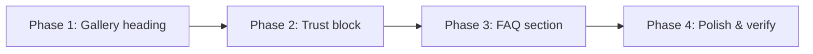

# Implementation Plan - FAQ, Gallery Heading & Trust Block

This plan covers three frontend improvements selected from the site review:

1. **FAQ section** — answer common questions before visitors reach Contact
2. **Gallery heading cleanup** — remove the redundant “Kézimunkáink galériája” headline
3. **Trust & social proof block** — testimonials and credibility signals to reinforce confidence

All work is **frontend-only** (no backend). Content can start as placeholder copy and be replaced with real quotes/details later.

---

## Scope & Page Order

Target section order after implementation:

```
Hero → About → Gallery → Pricing → Trust → FAQ → Contact → Footer
```

| Change | Files affected (expected) |
|---|---|
| FAQ section | New `src/components/FAQ.tsx`, `src/data/content.ts`, `src/App.tsx` |
| Gallery heading | `src/components/Gallery.tsx` |
| Trust block | New `src/components/Trust.tsx`, `src/data/content.ts`, `src/App.tsx`, optionally `src/components/Hero.tsx` |

Navigation (`Header.tsx`, `Footer.tsx`) does **not** need new links unless we later decide to add `#gyakori-kerdesek` to the nav — out of scope for now (FAQ is discoverable via scroll).

---

## 1. Gallery Heading Redundancy

### Problem

[Gallery.tsx](file:///d:/Coding/emlekor-kucko/src/components/Gallery.tsx) currently renders two competing headings:

- **Keep:** “Korábbi alkotások” (with eyebrow “Galéria” and supporting paragraph)
- **Remove:** “Kézimunkáink galériája” — duplicate meaning, different typography, adds visual noise

### Proposed Change

- Delete the second `<motion.h2>` block (“Kézimunkáink galériája”) and its associated animation props.
- Leave the existing section intro (eyebrow, primary H2, description, `PetalDivider`) unchanged.
- Confirm spacing: filter pills should sit at `mt-10` (or similar) directly below the divider — no awkward gap from the removed heading.

### Acceptance Criteria

- [x] Only one H2 remains in the Galéria section: “Korábbi alkotások”
- [x] Heading hierarchy is valid (one H2 per section, no skipped levels)
- [x] Vertical rhythm between intro, filters, and grid feels balanced on mobile and desktop

---

## 2. Trust & Social Proof Block

### Goal

Build confidence for a sensitive, high-trust product (breast milk / hair keepsake jewelry) without requiring a backend or live review integration.

### Proposed Design

New section **`Trust`** (`id="bizalom"`), placed **between Pricing and FAQ**.

**Layout (desktop):** centered section header + 3-column testimonial cards (stacked on mobile).

**Section header:**
- Eyebrow: `Bizalom` or `Visszajelzések`
- H2: e.g. “Akik már megőrizték emléküket”
- Short subline (optional): one sentence on discretion and handmade quality

**Testimonial cards (3 items):**
- Quote text (2–3 sentences max)
- Attribution: first name + city/region (e.g. “Kata, Budapest”) — no full names until approved
- Optional: small category chip (`Anyatejes medál`, `Hajas gyűrű`, etc.)

**Credibility row (below cards):**
Reuse/adapt signals already present elsewhere:
- “100% kézi munka”
- “6+ éve emlékeket őrzök”
- “Diszkrét, biztonságos feldolgozás” (aligns with Contact `ShieldCheck` message)

These can be styled as compact stat pills (similar to Hero floating badges) in a horizontal row on desktop, 2×2 or stacked on mobile.

### Hero Stat Badges (optional sub-task)

Hero currently hides stat badges on small screens (`hidden sm:block`). As part of trust polish:
- Either show simplified stat pills on mobile in Hero, **or**
- Rely on the new Trust section stats only (avoid duplication)

**Recommendation:** put stats in the Trust section; keep Hero clean on mobile. Mark Hero changes as optional in checklist.

### Content Source

Add to [content.ts](file:///d:/Coding/emlekor-kucko/src/data/content.ts):

```ts
export interface Testimonial {
  id: string;
  quote: string;
  name: string;       // e.g. "Kata"
  location: string;   // e.g. "Budapest"
  category?: string;  // optional chip label
}

export const testimonials: Testimonial[] = [ /* 3 items */ ];

export const trustStats: { value: string; label: string }[] = [ /* 3 items */ ];
```

Start with **placeholder quotes** clearly marked in content (replace before launch).

### Styling Notes

- Background: `bg-champagne-50` or `bg-blush-50/40` — distinct from adjacent white Pricing and gradient FAQ/Contact
- Cards: `glass-card` or white cards with `ring-blush-100`, subtle hover lift (match About value cards)
- Quote mark or `Heart` icon in blush accent (consistent with Gallery captions)
- Framer Motion: `whileInView` stagger on cards (match existing section patterns)

### Acceptance Criteria

- [x] New `Trust.tsx` component renders between Pricing and FAQ in `App.tsx`
- [x] Three testimonial cards with quote + attribution
- [x] Credibility stat row visible on all breakpoints
- [x] Section uses existing design tokens (blush/lavender/ink, Cormorant/serif headings)
- [x] Placeholder content documented for later replacement with real client-approved quotes

---

## 3. FAQ Section

### Goal

Answer the questions that block conversion — especially around sending materials, timing, hygiene, and customization — before the Contact form.

### Proposed Design

New section **`FAQ`** (`id="gyakori-kerdesek"`), placed **between Trust and Contact**.

**Layout:** centered header + accordion list (single-open or multi-open — recommend **single-open** for cleaner UX).

**Section header:**
- Eyebrow: `Gyakori kérdések`
- H2: e.g. “Amit gyakran kérdeznek”
- Subline: e.g. “Ha nem találod a választ, írj bátran — szívesen segítek.”

**Accordion item anatomy:**
- Trigger: question (serif or sans medium, full-width button)
- Panel: answer paragraph(s), optional bullet list
- Icon: `ChevronDown` rotating on open (Lucide, matches Gallery patterns)
- A11y: `aria-expanded`, `aria-controls`, keyboard Enter/Space to toggle

**Footer CTA (inside section):**
- Text link or soft button: “További kérdésed van? → Kapcsolat” linking to `#kapcsolat`

### Suggested FAQ Content (8 items)

Content to add in [content.ts](file:///d:/Coding/emlekor-kucko/src/data/content.ts):

| # | Question (HU) | Answer focus |
|---|---|---|
| 1 | Hogyan küldhetem el az anyatejet vagy a hajtincset? | Diszkrét csomagolás, postai/küldemény opciók, mit jelölj a csomagon |
| 2 | Mennyi anyag szükséges egy ékszerhez? | Approximate amounts for medál / gyűrű / nyaklánc |
| 3 | Mennyi idő az elkészítés? | Typical turnaround + consultation first |
| 4 | Biztonságos és higiénikus a feldolgozás? | Respectful handling, clean workspace (align with About copy) |
| 5 | Egyedi az ékszer, vagy van sablon? | Every piece unique; gallery as inspiration only |
| 6 | Milyen formákat és anyagokat választhatok? | Resin, gold/silver dust, dried petals — tie to pricing tiers |
| 7 | Mennyibe kerül egy ékszer? | Point to tájékoztató árak; final price after consultation |
| 8 | Tudok ajándékba rendelni? | Gift packaging tiers, discretion for surprises |

Copy should match Szabina’s warm, first-person tone where appropriate (“Gondosan kezelem…”, “Szívesen egyeztetünk…”).

### Styling Notes

- Background: `bg-white` or very light blush — contrast with Trust section above
- Accordion borders: `border-blush-100`, rounded-2xl items with gap between
- Open state: subtle `bg-blush-50/60` on active item
- Animation: Framer Motion height/opacity on panel, or CSS grid `grid-template-rows` trick for smooth expand

### Acceptance Criteria

- [ ] New `FAQ.tsx` component with accessible accordion behavior
- [ ] 8 Q&A items driven from `content.ts`
- [ ] Section placed between Trust and Contact in `App.tsx`
- [ ] CTA link to `#kapcsolat` at bottom of section
- [ ] Keyboard and screen-reader friendly (focus visible on triggers, `aria-expanded` toggles)

---

## Implementation & Tracking Checklist

### Phase 0: Content Prep
- [x] Draft 3 testimonial quotes + attributions (placeholder OK, mark for review)
- [x] Draft 3 trust stat labels (reuse Hero copy where possible)
- [ ] Draft 8 FAQ questions and answers in Hungarian
- [ ] Szabina review: approve tone, facts (timelines, amounts, shipping)

### Phase 1: Gallery Heading Cleanup *(quick win)*
- [x] Remove “Kézimunkáink galériája” `<motion.h2>` from [Gallery.tsx](file:///d:/Coding/emlekor-kucko/src/components/Gallery.tsx)
- [x] Adjust spacing between `PetalDivider` and filter pills if needed
- [ ] Visual check: mobile + desktop gallery header

### Phase 2: Trust & Social Proof Block
- [x] Add `Testimonial` type + `testimonials` + `trustStats` arrays to [content.ts](file:///d:/Coding/emlekor-kucko/src/data/content.ts)
- [x] Create [Trust.tsx](file:///d:/Coding/emlekor-kucko/src/components/Trust.tsx) with section header, testimonial grid, stat row
- [x] Register `<Trust />` in [App.tsx](file:///d:/Coding/emlekor-kucko/src/App.tsx) after `<Pricing />`, before FAQ
- [x] Apply Framer Motion entrance animations (consistent with About/Pricing)
- [x] Responsive pass: 1-col mobile, 3-col desktop for cards; stat row wraps cleanly
- [x] *(Optional)* Show Hero stat badges on mobile — skip if Trust stats are sufficient

### Phase 3: FAQ Section
- [ ] Add `FAQItem` type + `faqItems` array to [content.ts](file:///d:/Coding/emlekor-kucko/src/data/content.ts)
- [ ] Create [FAQ.tsx](file:///d:/Coding/emlekor-kucko/src/components/FAQ.tsx) with accordion UI
- [ ] Implement open/close state (single-open recommended)
- [ ] Register `<FAQ />` in [App.tsx](file:///d:/Coding/emlekor-kucko/src/App.tsx) after `<Trust />`, before `<Contact />`
- [ ] Add bottom CTA linking to `#kapcsolat`
- [ ] Accessibility pass: focus states, ARIA attributes, keyboard navigation

### Phase 4: Integration & Polish
- [ ] Verify full-page scroll flow: Pricing → Trust → FAQ → Contact feels cohesive
- [ ] Check background alternation between sections (no two identical bands adjacent)
- [ ] Confirm heading font convention matches site (Cormorant/serif per existing sections)
- [ ] Run `npm run lint` and `npm run typecheck`
- [ ] Replace placeholder testimonials with approved real quotes before public launch

---

## Verification Plan

### Manual Verification

1. **Gallery**
   - Open `#galeria`: single H2 only, filters and grid unchanged functionally

2. **Trust**
   - Desktop: 3 testimonial cards + stat row aligned and readable
   - Mobile: cards stack, stats wrap without overflow
   - Copy reads naturally in Hungarian

3. **FAQ**
   - Click each question: panel opens/closes smoothly
   - Only one item open at a time (if single-open chosen)
   - Tab through triggers: focus ring visible, Enter toggles
   - “Kapcsolat” CTA scrolls to contact section

4. **Regression**
   - Gallery filters, lightbox, mobile “Több mutatása” still work
   - Contact form and existing nav links unaffected
   - No layout shift or horizontal scroll on 320px viewport

### Responsive Breakpoints to Test

- 320px (small phone)
- 375px (iPhone)
- 640px (`sm` — gallery grid change)
- 1024px (`lg` — trust 3-column, pricing 3-column)

---

## Out of Scope (for this plan)

- Backend contact form submission
- Live Google/Facebook review embeds
- New nav item for FAQ (`#gyakori-kerdesek`)
- Instagram feed integration
- Impressum / Adatvédelem pages
- Structured data / SEO schema for FAQ (`FAQPage` JSON-LD) — nice follow-up later

---

## Suggested Implementation Order



Start with Phase 1 (smallest diff, immediate clarity), then Trust (new visual section), then FAQ (most content + interaction work).
